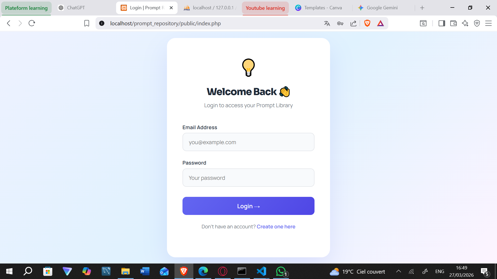
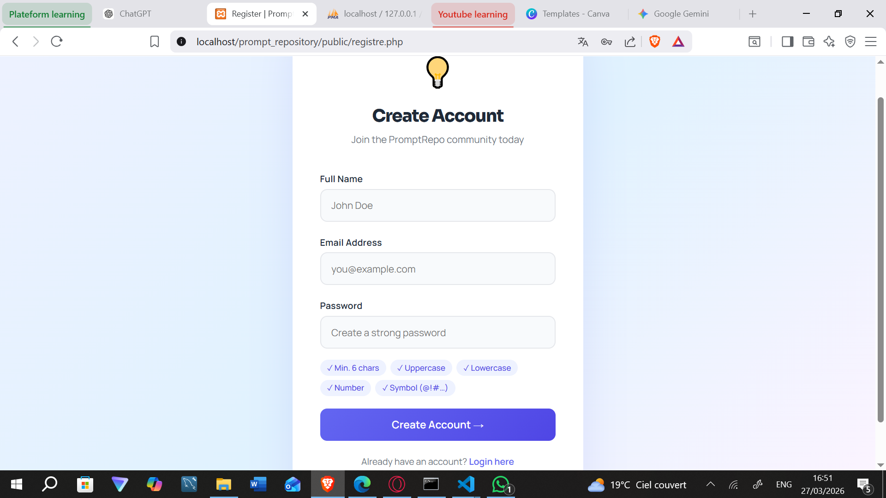
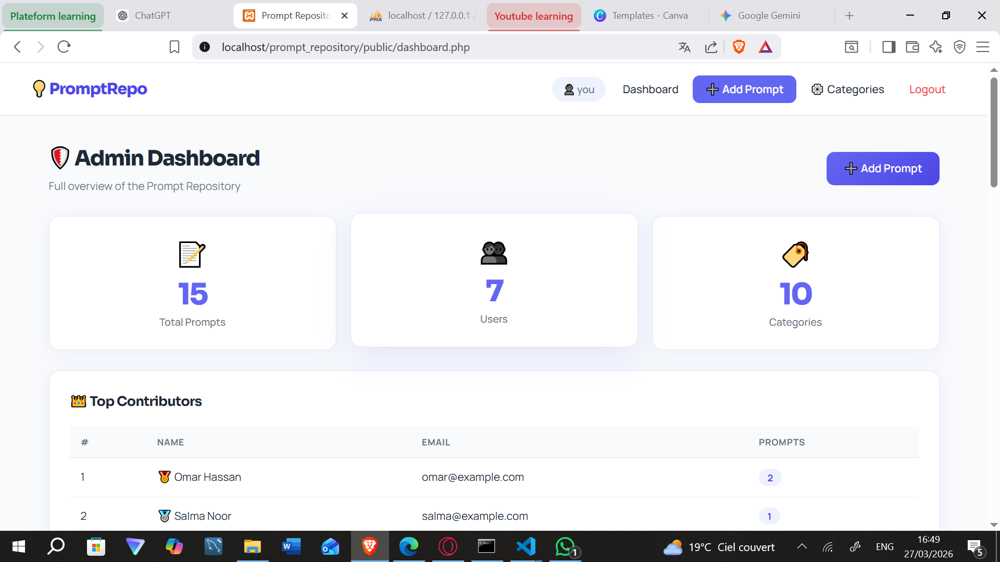
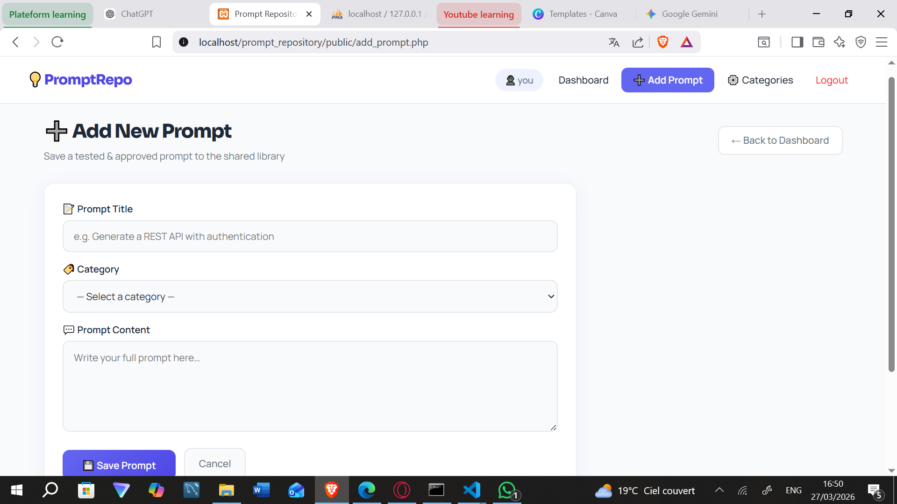
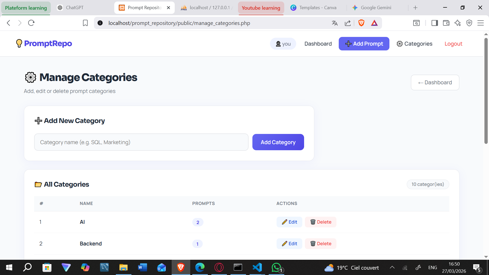

# Prompt Repository - Knowledge Base des Prompts Performants

## Contexte

Prompt Repository est une application interne de Knowledge Management pour centraliser les prompts "testes et approuves" utilises par les equipes DevGenius Solutions.

Objectif: ne plus perdre les prompts efficaces dans les historiques de chat, et permettre leur reutilisation rapide par thematique.

## Fonctionnalites

- Inscription et connexion securisees (sessions PHP).
- Enregistrement de prompts avec titre, contenu et categorie.
- Filtrage des prompts par categorie.
- Recherche par mots-cles (titre et contenu).
- Edition et suppression des prompts.
- Espace admin:
  - Gestion CRUD des categories.
  - Tableau de bord avec statistiques globales.
  - Classement des contributeurs les plus actifs.

## Stack Technique

- PHP (procedural, PDO)
- MySQL / MariaDB
- HTML5
- CSS3
- Sessions PHP

## Architecture de la Base de Donnees

Tables obligatoires:

- `users`
- `categories`
- `prompts`

Relations:

- `prompts.user_id` -> `users.id` (FK)
- `prompts.category_id` -> `categories.id` (FK)

Le schema SQL complet est disponible dans:

- `sql_db/db.sql`

## Securite Implantee

- Hashage des mots de passe avec `password_hash()`.
- Verification a la connexion avec `password_verify()`.
- Requetes preparees PDO sur toutes les operations SQL.
- Validation serveur des formulaires (champs vides, formats, controles metier).
- Controle d'acces par session (`auth.php`) pour les pages protegees.

## Structure du Projet

```
prompt_repository/
├── actions/            # Traitements backend (login, register, CRUD prompts/categories)
├── assets/             # Styles CSS
├── config/             # Connexion PDO
├── includes/           # Header, footer, auth
├── public/             # Pages accessibles (UI)
├── sql_db/             # Schema + seed SQL
└── README.md
```

## Installation (Local)

### 1. Prerequis

- PHP 8+
- MySQL/MariaDB
- Serveur local type XAMPP/WAMP/Laragon

### 2. Cloner le projet

```bash
git clone <url-du-repo>
cd prompt_repository
```

### 3. Configurer la base de donnees

1. Creer/importer la base via `sql_db/db.sql`.
2. Verifier les identifiants de connexion dans `config/db.php`.

Configuration actuelle attendue:

- Host: `localhost`
- Port: `3307`
- Database: `prompt_repository`
- User: `tester`
- Password: `123`

### 4. Lancer le projet

- Placer le dossier dans votre repertoire web (ex: `htdocs`).
- Acceder a l'application via:
  - `http://localhost/Prompt_Repository/public/index.php`

## Comptes de Test

Le fichier SQL propose des utilisateurs seed.

Si vous devez regenerer un hash de mot de passe:

```bash
php -r "echo password_hash('DevGenius@2024', PASSWORD_DEFAULT), PHP_EOL;"
```

## Workflow de Demonstration (Evaluation)

1. Inscription d'un nouvel utilisateur.
2. Connexion.
3. Ajout d'un prompt (titre + categorie + contenu).
4. Filtrage des prompts par categorie.
5. (Admin) Gestion des categories et consultation des top contributeurs.

## Requetes et Points Techniques a Presenter

- Exemple de listing avec `INNER JOIN` pour afficher auteur + categorie.
- Tri des prompts du plus recent au plus ancien (`ORDER BY created_at DESC`).
- Protection contre SQL Injection via PDO prepare statements.

## Captures d'Ecran

### Connexion



### Inscription



### Dashboard Admin



### Ajout d'un Prompt



### Gestion des Categories



## Ameliorations Possibles (Bonus)

- Refactor en mode OOP (Repository/Service classes).
- Recherche multi-criteres avancee (titre + categorie + auteur).
- Pagination des prompts.
- CSRF token sur les formulaires sensibles.

## Auteur

Projet realise dans le cadre de la formation Simplon - Full-Stack & IA.
